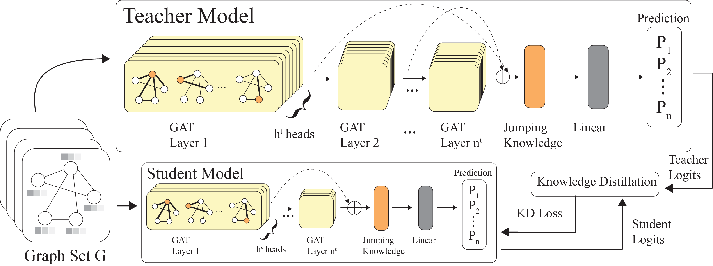

Abstract—The Controller Area Network (CAN) protocol is
widely adopted for in-vehicle communication; however, its lack
of inherent security mechanisms makes it vulnerable to various
cyber-attacks. This paper presents KD-GAT, an intrusion de-
tection framework based on Graph Attention Networks (GATs)
and knowledge distillation (KD), designed to improve detec-
tion accuracy while reducing computational complexity. In the
proposed approach, CAN traffic is transformed into graph-
structured representations using a sliding window technique to
capture temporal and relational patterns among messages. A
multi-layer GAT with jumping knowledge aggregation serves
as the teacher model, and a compact student GAT is trained
through a two-phase procedure involving supervised pretraining
and knowledge distillation with soft and hard label supervision.
Experiments were conducted on three benchmark datasets: Car-Hacking, Car-Survival, and can-train-and-test. Initial results in Car-Hacking and Car-Survival see both the teacher and student perform well, with the student model in particular achieving
over achieve 99.97% and 99.31% accuracy, respectively. While train and validation results were promising, the significant class imbalance in the can-train-and-test dataset caused both models to under perform. Future research will need to be conducted to tackle the class imbalance.

