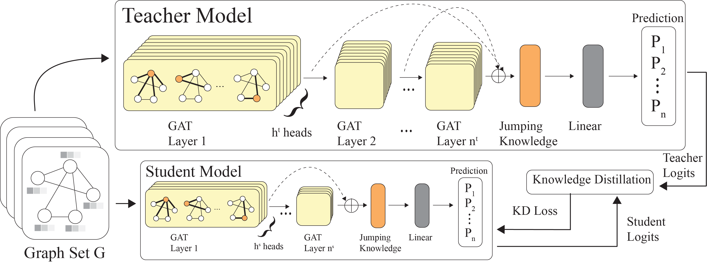

**Venue:** IEEE International Conference on Intelligent Transportation Systems (ITSC) 2025 *(to appear)*

**Authors:** R Frenken, SG Bhatti, H Zhang, Q Ahmed

[Paper PDF](../files/IEEE_ITSC_2025-2.pdf)

## Abstract

The Controller Area Network (CAN) protocol is widely adopted for in-vehicle communication; however, its lack of inherent security mechanisms makes it vulnerable to various cyber-attacks. This paper presents KD-GAT, an intrusion detection framework based on Graph Attention Networks (GATs) and knowledge distillation (KD), designed to improve detection accuracy while reducing computational complexity. In the proposed approach, CAN traffic is transformed into graph-structured representations using a sliding window technique to capture temporal and relational patterns among messages. A multi-layer GAT with jumping knowledge aggregation serves as the teacher model, and a compact student GAT is trained through a two-phase procedure involving supervised pretraining and knowledge distillation with soft and hard label supervision. Experiments were conducted on three benchmark datasets: Car-Hacking, Car-Survival, and can-train-and-test. Initial results in Car-Hacking and Car-Survival see both the teacher and student perform well, with the student model in particular achieving over 99.97% and 99.31% accuracy, respectively. While train and validation results were promising, the significant class imbalance in the can-train-and-test dataset caused both models to under perform. Future research will need to be conducted to tackle the class imbalance.

## Architecture

